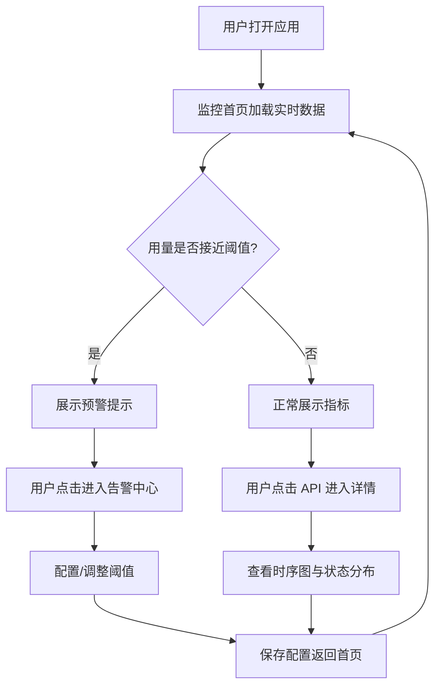

## 1. 产品概述
一款移动端 API 用量实时监控组件，帮助开发者和运维人员随时掌握 API 调用情况、配额消耗和异常状态。
- 面向开发者和运维工程师，解决 API 用量不可见、超限风险难预判的问题
- 提供实时数据可视化、配额预警和历史趋势分析，降低 API 成本风险

## 2. 核心功能

### 2.1 用户角色
| 角色 | 注册方式 | 核心权限 |
|------|----------|----------|
| 开发者 | 账号注册 | 查看监控数据、配置阈值、接收告警 |
| 运维工程师 | 账号注册 | 查看全部 API、管理配额、处理告警 |

### 2.2 功能模块
1. **监控首页**: 实时用量概览、关键指标卡片、趋势图表
2. **API 详情页**: 单个 API 调用明细、时序图、状态码分布
3. **告警中心**: 配额预警、异常通知、阈值配置

### 2.3 页面详情
| 页面名称 | 模块名称 | 功能描述 |
|----------|----------|----------|
| 监控首页 | 实时指标卡片 | 今日调用量、剩余配额、成功率、平均延迟实时展示 |
| 监控首页 | 趋势图表 | 24小时调用趋势折线图，支持切换时间范围 |
| 监控首页 | API 列表 | 按调用量排序的 API 列表，含状态标签 |
| API 详情页 | 调用时序图 | 分钟级调用频次，标注峰值和异常点 |
| API 详情页 | 状态码分布 | 2xx/4xx/5xx 占比环形图 |
| API 详情页 | 延迟统计 | P50/P95/P99 延迟指标 |
| 告警中心 | 预警列表 | 配额达 80%/95% 预警，异常状态码激增告警 |
| 告警中心 | 阈值配置 | 自定义各 API 的用量和错误率阈值 |

## 3. 核心流程
用户进入监控首页查看实时用量概览，点击具体 API 进入详情页查看明细数据，当用量接近阈值时在告警中心处理预警并调整配置。

## 4. 用户界面设计

### 4.1 设计风格
- 主色调: 深空黑 (#0A0E1A) 背景 + 霓虹青 (#00E5FF) 强调色 + 警示橙 (#FF6B35)
- 辅助色: 卡片半透明白 (#1A1F2E)、成功绿 (#00D9A3)、错误红 (#FF4757)
- 按钮风格: 圆角胶囊形，带霓虹辉光阴影
- 字体: 标题用 JetBrains Mono (数据感)，正文用 HarmonyOS Sans
- 布局: 移动端卡片式纵向滚动，顶部固定状态栏
- 图标: 线性图标 + 微动效，数据用 SVG 实时绘制

### 4.2 页面设计概览
| 页面名称 | 模块名称 | UI 元素 |
|----------|----------|---------|
| 监控首页 | 顶部状态栏 | 应用名、实时时钟、连接状态指示灯(脉冲动画) |
| 监控首页 | 指标卡片区 | 2x2 网格卡片，数字滚动动画，进度条配额展示 |
| 监控首页 | 趋势图表区 | SVG 折线图，渐变填充，触摸高亮数据点 |
| 监控首页 | API 列表 | 紧凑列表项，左侧色条状态指示，右侧调用次数 |
| API 详情页 | 时序图 | 面积图带峰值标注，可拖拽时间轴 |
| API 详情页 | 状态码环形图 | SVG 圆环，hover 显示数值 |
| 告警中心 | 预警卡片 | 带严重级别色条，左滑可处理 |

### 4.3 响应式设计
- 移动端优先设计 (375px 基准宽度)
- 适配 320px-428px 主流手机宽度
- 触摸优化: 最小点击区域 44px，支持滑动手势
- 横屏自适应布局调整

## 4.4 3D 场景说明
本项目不涉及 3D 场景。
