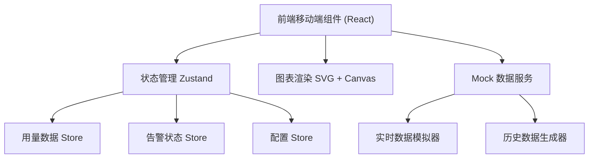

## 1. 架构设计



## 2. 技术说明
- 前端: React@18 + TypeScript + tailwindcss@3 + vite
- 初始化工具: vite-init
- 状态管理: Zustand
- 图表: 纯 SVG 自绘 (折线图/环形图/面积图)
- 数据: Mock 实时数据模拟 (无后端，前端内置数据生成器)
- 动画: CSS + requestAnimationFrame 驱动数字滚动

## 3. 路由定义
| 路由 | 用途 |
|------|------|
| / | 监控首页 - 实时用量概览与趋势 |
| /api/:id | API 详情页 - 单个 API 明细数据 |
| /alerts | 告警中心 - 预警列表与阈值配置 |

## 4. 数据模型

### 4.1 核心数据结构

```typescript
// API 监控项
interface ApiMetric {
  id: string;
  name: string;
  method: 'GET' | 'POST' | 'PUT' | 'DELETE';
  path: string;
  todayCalls: number;
  totalQuota: number;
  usedQuota: number;
  successRate: number;
  avgLatency: number;
  p50Latency: number;
  p95Latency: number;
  p99Latency: number;
  statusCodes: { code: number; count: number }[];
  trend: { time: string; calls: number; errors: number }[];
  status: 'healthy' | 'warning' | 'critical';
}

// 告警项
interface Alert {
  id: string;
  apiId: string;
  apiName: string;
  type: 'quota' | 'error_rate' | 'latency';
  severity: 'warning' | 'critical';
  message: string;
  threshold: number;
  currentValue: number;
  timestamp: number;
  resolved: boolean;
}

// 全局统计
interface GlobalStats {
  totalCallsToday: number;
  totalQuota: number;
  usedQuota: number;
  avgSuccessRate: number;
  avgLatency: number;
  activeApis: number;
  trend24h: { time: string; calls: number }[];
}
```

## 5. 实时数据模拟策略
- 每 2 秒更新一次用量数据，模拟真实 API 调用增量
- 数字滚动使用 requestAnimationFrame 实现平滑过渡
- 趋势图数据点随时间推移滚动更新
- 用量达到 80%/95% 阈值时自动生成告警
